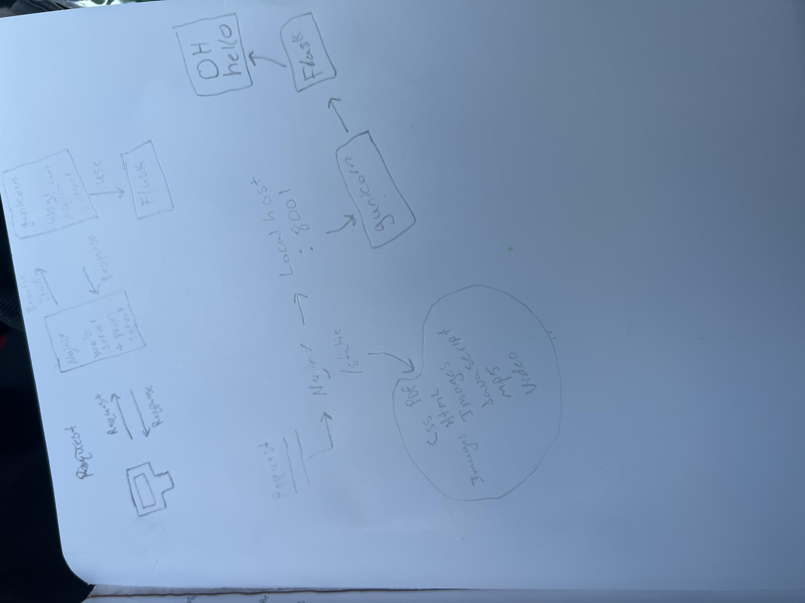

Noah Fsu Id: nws17
Marlee Fsu Id: mmk20a
CourseNumber:Cop4342-0001
GroupNumber: 14

#Config

#whats where
Our myproject.py is our main flask project it contains all the routes for our projects. In our templates folder we have all of our html files. iOur login.html is the login page. Our signup.html is our signup page. Home.html is the defualt path after logging in. our news.html contains the articles from our database. The Admin.html will be the page our admin users are redirected to after login. Our UserProfiles.html page will have all of our users emails and names displayed as well as their associated likes with the option for the admin to delete them. Our schema.lsql is what constructs the table for all the articles to be stored and shown to the database. Our artSchema.sql has the tables in order to have each user stored with their name and email. Their email is the key that will associate them with their respective list of liked articles.Our database.db hold all the articles for printing to our news.html.Our likedArticles.db is the database where the liked articles for the respective user are stored. 
#Whats implemented and what still needs done
We have our sql database setup right now and we can succsefully store articles into our database and print them with their links to the news page. We have one data base which loads all articles for storage so we don't have to pull from hacker news every time we want to veiw them. Our actual database for the assignment is behaving correctly. It stores a user's name and email and has a list associated with each. The users email acts as a key to acsess each individuals liked articles. Once we are able to pull the users name and email we will be able to find the current sessions users and add the liked articles to the current users session email. Our admin page with be able to see the users and their all of their liked articles. We will have an array that holds admin emails and after login if the current users email is in that array they will be redirected to the admin page instead of the defualt home page. The likes and current users in session must be acsessed through a post in the html. Once we figure this part out we the rest of the implementation will be stright forward. Basically the rest of the projects implemenation depends on these posts from the html but the backend is almost complete. We will handle the admins ability to delete a post from the user similarly to how we add a post to the user. By checking the users email and dealing with that post by it's title. 
# How the command curl noahwilliamshaffer.com works

We call the curl command on our domain and it sends a synchronized tcp/ip request to the DNS to get our server's IP. Nginx revives the packets sent by curl, accepts them, and sends back a response to complete the handshake. If the server is udp then this becomes a connectionless protocol. The packets are initially sent on port 80. Then our nginx.conf will reroute the port to 443. Certbot changed niginx.conf to do this.  Now our domain that was initially on port 80 with the prefix HTTP will now be on port 443 with the prefix HTTPS. Niginix connects to gunicorn via wsgi. It works as a proxy for Gunicorn. Gunicorn invokes flask which works with the html files in the templates folder and accesses our database. This is where we pull the html from. The flask app goes back to gunicorn and then nginx. It then returns the html to the client. 

## How we secure our site.

For security we will white list our ip addresses, not only from our ufw, but also on nginx for making a connection to out server through ssh so that the server can only be accessed in places and computers that we find acceptable. In addition, we use https which really keeps the site secure for our user. Also, just by being aware of updates not only on digital ocean, but on all of the tools we are using for hosting will help us prevent our server and site from being exploited by known zero days. We also only use ssh keys to get onto our server, and the only password is used internally to go from user to root access. Something that will be done which has not be unfortunately is to disable root logins. Using nginx is also an important part of our security because it lessens the attack surface and when it acts as a proxy it keeps the parts of the site that actually hold the files and host the site safe because only nginx is interacting with the web.

## How we deal with updates and upgrades
To deal with updates and upgrades we are curently using the unintended upgrades package on ubuntu to upgrade aspects of the server, it is automated and happens at random times daly. Updates and upgrades is something that we are flexable with and if we decade towrds the end of the project that unintended upgrades is not updating all the packets neccesary, we plan on implmenting ansble for updates and upgrades.

## configuration path 
 the file paths of our ssh/nginx/gunicorn/dns configuration are:

## Description
Let people know what your project can do specifically. Provide context and add a link to any reference visitors might be unfamiliar with. A list of Features or a Background subsection can also be added here. If there are alternatives to your project, this is a good place to list differentiating factors.

## whats in our repository
Our repository contains a flask app called myproject.py that runs a site though nginux, and gunicorn. It runs on the virtual enviornment which is in the ServerEnv file directioriy. With in our repository we have sqlite3 database files holding the data that we are using on our flask app. Within the templates directory we have the html documents that make up the interactive interface of the site. 

## Installation
to replicate this project you can clone this git repo.
first you need to make a vm, we used digitaloceans to make ours we followed this tutorial
https://www.digitalocean.com/community/tutorials/initial-server-setup-with-ubuntu-22-04
then we made sure our ssh keys were implemented on the server:
https://www.digitalocean.com/community/tutorials/how-to-set-up-ssh-keys-on-ubuntu-20-04
then we made our ngunix and giunicorn servers uinsg a flask app following this tutorial
https://www.digitalocean.com/community/tutorials/how-to-serve-flask-applications-with-gunicorn-and-nginx-on-ubuntu-22-04
we used godady to get the domain for our server, and connected the domain we bought to digital oceans this blog helped to make 
the implementation more streamlined
https://blog.devgenius.io/point-godaddy-domain-to-digitalocean-droplet-c7d24f423cad
 
to implement auth0 into our aplication we follwed the format of there git tutorial
https://github.com/auth0-samples/auth0-python-web-app/tree/master/01-Login

for implimentation of the sqlite databases we followed:
https://www.digitalocean.com/community/tutorials/how-to-make-a-web-application-using-flask-in-python-3

for security we refrinced this tutorial
https://www.digitalocean.com/community/tutorials/how-to-set-up-a-firewall-with-ufw-on-ubuntu-20-04
we also reomend to implement whitelisting of the ips as well as passwordless ssh connection
commands like this allow you to white list ips on the firewall 
:sudo ufw allow in from 123.123.321.1 to any port 22 
and used this site as refrence for securing our nginix config headers.
https://webdock.io/en/docs/how-guides/security-guides how-to-configure-security-headers-in-nginx-and-apache
utilising the resorces above and this git repo you should be on yourway to hosting a hacker news site in no time.

## Usage
You can use this git repo to host a site that is a forum for hacker news articles

## Support
for making the nginux and gunicorn server using a flask app on digital oceans use:
https://www.digitalocean.com/community/tutorials/how-to-serve-flask-applications-with-gunicorn-and-nginx-on-ubuntu-22-04

for making a auth0 login use:
https://github.com/auth0-samples/auth0-python-web-app/tree/master/01-Login

for sqlite use and getting information from your api use:
https://www.digitalocean.com/community/tutorials/how-to-make-a-web-application-using-flask-in-python-3

## Authors and acknowledgment
This project was produced and developed by Marlee Krause and Noah Shaffer
